  

<h3 align="center">🚀 Full Stack Developer | React Developer | Backend Developer </h3>

  

---

## 🚀 About Me

- 🎓 B.Tech CSE Graduate (2025)
- 🏆 GATE CSE Qualified
- 💻 Full Stack Developer | MERN Developer
- 🌱 Learning System Design & CI/CD Pipeline
- ⚡ Building React, Node.js & Python Projects
- 📍 Delhi, India

---

## 🛠️ Tech Stack

---

## 📊 GitHub Stats

## 📈 Contribution Graph

---

# 🔥 GitHub Streak

## 📈 GitHub Analytics

  
  

  
  

## 🌟 Featured Projects
| Project | Description |
|----------|------------|
| 🚀 API Testing Platform | Postman Lite Clone |
| 🎯 AI Calorie Tracker | React + Node.js |
| ⏰ Desktop Timer | Electron Desktop App |
| 🎬 Movie API | Express.js CRUD API |
| 📚 PDF Quiz Generator | AI Powered Test Platform |

---

## 🤝 Connect With Me

---

  

⭐ Thanks for visiting my profile! ⭐

## 🐍 Contribution Snake

  

